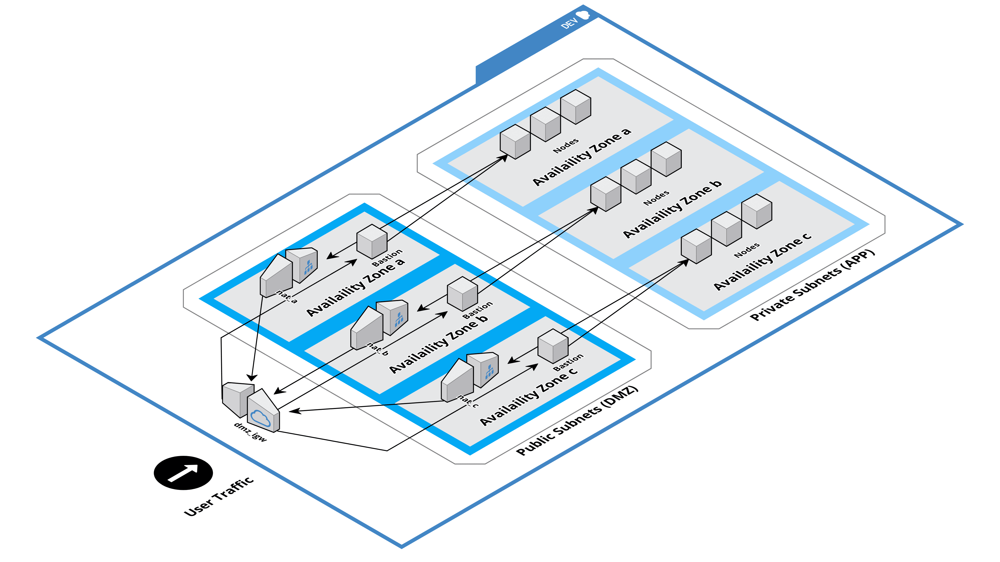
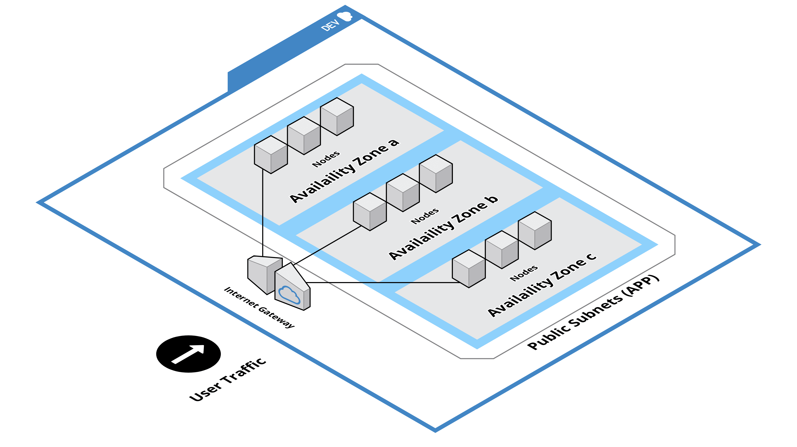

# Terraform AWS - Network

This the first in a series of repositories for using Terraform to create and manage environments within AWS.  As such, all prerequisites mentioned here are required for the repositories in this series.

#### Series

1. [Terraform AWS - Network](https://github.com/nuarch/terraform-aws-network)
2. [Terraform AWS - Rancher 2 HA Module](https://github.com/nuarch/terraform-aws-rancher-server-ha)

## Overview

Every environment first requires a network. This module allows you to setup either a secure network or a simple network (default).  The secure network provides a VPC, DMZ subnet group, bastion instances, APP subnet group, and NAT'd application instances; the simple network provides a VPC and exposed APP subnet group.  

Both networks use three availability zones, with one subnet per zone in each subnet group (i.e. DMZ or APP).

As all subnets are exposed to outside world, the simple network option should only be used for testing or as internal part of a larger private cloud/intranet.

## Secure network



### Core Features

- The Internet can communicate with DMZ subnet group.
- The Internet cannot communicate with APP subnet group.
- DMZ subnet group can communicate with Application subnet group.
- APP subnet group can communicate with the Internet through NAT gateway.

### Additional features

- Ability to deploy bastion instances in DMZ subnet which can be accessed from the Internet to diagnose instances in APP subnet.

## Simple network



### Core Features

- The Internet can communicate with APP subnet group.
- APP subnet group can communicate with the Internet.

## References
- [Reference to decide default sizing of VPC and subnets](https://docs.aws.amazon.com/vpc/latest/userguide//VPC_Subnets.html)

## Prerequisites

- [Terraform v0.12.x](https://learn.hashicorp.com/terraform/getting-started/install)
- AWS Account ([create account](https://portal.aws.amazon.com/billing/signup?redirect_url=https%3A%2F%2Faws.amazon.com%2Fregistration-confirmation#/start))
- [AWS CLI v2](https://docs.aws.amazon.com/cli/latest/userguide/install-cliv2.html) ([configure for account](https://docs.aws.amazon.com/cli/latest/userguide/cli-chap-configure.html))
- EC2 instance key pair to ssh into instances within DMZ subnet (i.e. bastion) ([creation instructions](https://docs.aws.amazon.com/AWSEC2/latest/UserGuide/ec2-key-pairs.html#having-ec2-create-your-key-pair))

## Deployment Instructions

1. Checkout repo to local directory
2. Modify *variables.tf* as follows (or see Step 5 for alternate method)

    * Adjust AWS profile, region and availability zones.  Please note that AWS credentials are defined within a profile.
    * Optionally enable bastion, set source IP range, key pair, instance type, and instance image.
    * Optionally adjust environment and tags

3. Install terraform providers and modules
  ```
  terraform init
  ```
4. Preview terraform execution plan
  ```
  terraform init
  ```
5. Deploy via

        terraform apply
  or, apply by overriding variables

        terraform apply -var="environment=TEST" -var="region=us-west-2" -var="test_instances_enabled=true" -var="bastion_instances_enabled=true" -auto-approve

  *auto-approve* option removes need to confirm

6. Teardown via (destructive so be careful)

        terraform destroy

## Notes

* EC2 instances will not accept a .pem key if it is publicly visible.  To fix change permissions *chmod 400 <my-key.pem>*, which restricts user/owner to read-only access.
* Default image setting is a minimal Ubuntu bionic version.  When connecting via ssh, use *ubuntu* as the user.  Example:

        ssh - <PATH_TO_KEY>/my-key.pem ubuntu@<XXX.XXX.XXX.XXX>

# License

Copyright (c) 2020 nuArch LLC

Licensed under the Apache License, Version 2.0 (the "License"); you may not use this file except in compliance with the License. You may obtain a copy of the License at

http://www.apache.org/licenses/LICENSE-2.0

Unless required by applicable law or agreed to in writing, software distributed under the License is distributed on an "AS IS" BASIS, WITHOUT WARRANTIES OR CONDITIONS OF ANY KIND, either express or implied. See the License for the specific language governing permissions and limitations under the License.
